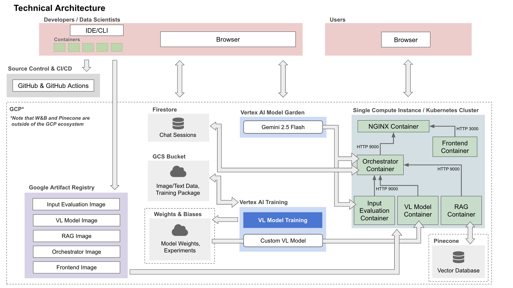

# BiteFinder: Using Multimodal AI to Identify Bug Bites and Deliver Personalized Treatment Advice

*This article was produced as part of the final project for Harvard’s AC215 Fall 2025 course.*

*[Project GitHub Repo](https://github.com/beni-1414/ac215_bitefinder)*

*[Demo Video — placeholder]*

*Team: Jack Hwang, Zoe Zabetian, Irith Katiyar, Benet Fité Abril*

## Table of Contents

- [Introduction](#introduction-🐜)
- [Problem & Motivation](#problem--motivation-🕷️)
- [Our Solution](#our-solution-🔍)
- [Application Architecture](#application-architecture-⚙️)
- [ML Pipeline](#ml-pipeline-🚀)
- [Deployment & MLOps](#deployment--mlops-☁️)
- [Impact & Next Steps](#impact--next-steps-🌎)
- [References](#references-📚)

## Introduction 🐜

Imagine waking up with an itchy red bump on your arm, after hiking or spending time outdoors in a nice hot summer day. Was it a mosquito? A tick? Something more concerning? Most people don’t know, and searching online often leads to vague advice, panic-inducing speculation, or worse, misinformation. In the era of AI, where image recognition and large language models have made leaps in understanding visual and textual data, this uncertainty feels unnecessary.

**BiteFinder** aims to change that. It is an AI-powered web application that helps users **identify bug bites** from an image and receive **trusted, medically grounded treatment recommendations**. By combining **multimodal learning**, **agentic AI**, and **retrieval-augmented generation**, BiteFinder transforms a user’s photo and symptom description into actionable guidance in seconds.

Whether you're a curious camper, concerned parent, or bug enthusiast, BiteFinder provides accessible, personalized insights right when you need them.

## Problem & Motivation 🕷️

Arthropods are responsible for millions of bites each year, many of which result in:

- misidentification of the biting species
- delayed or incorrect treatment
- unnecessary anxiety
- avoidable doctor visits

Online resources are fragmented and generic, and while medical professionals can diagnose bites, access to one is not always immediate or affordable. Furthermore, ChatGPT-like LLMs can generate convincing but unvalidated advice, and often reject to answer due to safety concerns.

**Our goal**: build a system that can classify the type of bug bite from a user's image and symptoms, and offer accurate, contextual advice on treatment and prevention instantly.

## Our Solution 🔍

BiteFinder combines **multimodal ML**, **agentic LLMs**, and **vector knowledge retrieval** to create a guided, conversational experience.

A user simply needs to:

1. Upload an image of a bite and describe symptoms and bite location
2. Receive a prediction such as *“mosquito”*, *“tick”*, *“spider”*, etc.
3. Ask follow-up questions like:
   - *"How should I treat my bite?"*
   - *"Should I go to the ER?"*
   - *"How long will swelling last?"*
4. Get medically grounded responses tailored to your specific case

The two key innovations that make BiteFinder possible is our custom **vision-language ML model**, fine-tuned for bug bite prediction, and **Ranger Rick**, a *LangChain* agent that drinks from a *Pinecone* RAG pipeline.

## Application Architecture ⚙️

Our system follows a microservices design:

- **Input Evaluation Service** — checks text completeness and image quality/relevance
- **Vision-Language Model Service** — performs bug bite prediction
- **RAG Service** — retrieves medical context and generates treatment guidance
- **Orchestrator Service** — controls the conversation, hosts the *LangChain* agent, and coordinates all upstream services
- **Frontend** — a React-based chat interface that enables seamless interaction, that also hosts many informative resources about bug bites, including general prevention tips and a seasonal bug calendar

Each backend service is organized as a Dockerized stateless FastAPI container. This design is summarized in our technical architecture diagram and the following sections:

## ML Pipeline 🚀

The data for training the model comes from [Kaggle's Bug Bite Images dataset](#references). Our machine learning pipeline has three components:

- **Synthetic label generator** – creates diverse symptom/location labels using LLM-based synthesis
- **Image augmentation** – expands dataset via rotation, jitter, and perturbations
- **Vision-language classifier** – uses paired image–text embeddings to identify bug bite type

We experimented with two research-backed vision-language architectures: **CLIP** and **ViLT**. To fine-tune them, we performed systematic hyperparameter sweeps to achieve not only high accuracy but also high definitiveness in its predictions. Our best-performing CLIP model reached a validation **94% accuracy** and **93% confidence on correct predictions**.

## Deployment & MLOps ☁️

BiteFinder is deployed with a **modern MLOps tech stack** that lives largely within the GCP ecosystem:

- **Dockerized microservices** running on a Kubernetes cluster, capable of autoscaling and load balancing to meet demand
- **Pulumi** for deployment infrastructure-as-code automation
- **GitHub Actions** for CI/CD, ensuring automated testing, app deployment, and ML deployment
- **Vertex AI** for running automated serverless training jobs and their LLM model garden
- **Google Artifact Registry** for versioned microservice container images for production
- **Google Cloud Storage** for image/text data storage and versioning
- **Weights & Biases** for experiment tracking and model storage and versioning
- **Firestore** for user session management and conversation history
- **Pinecone** for vector-based medical knowledge retrieval

Even better, the entire application can be rebuilt via a single `/deploy-app` commit trigger. And, if we want to update our classifier for better performance, we can train and deploy our vision-language model in a single line of code!

## Impact & Next Steps 🌎

BiteFinder democratizes access to bite-related medical knowledge by providing:

- **Explainable predictions** backed by a custom trained vision-language model, not general LLM guesswork.
- **Fast, personalized insights** at the moment of concern, backed by trusted medical sources.
- **Reduced medical uncertainty** for users without clinical expertise or immediate access to care.

The next planned steps for BiteFinder are:
- Expand the dataset to include other venomous animal encounters, and better distinguish between bites and other skin conditions.
- Add a monetization layer on top of the RAG, so it recommends sponsored treatment or prevention products based on the user’s specific case.
- Public health and epidemiological monitoring of bug bite prevalence.
- Offline mobile app for use in extreme remote areas.

*Curious how BiteFinder works? Explore our repo and try the app, just don’t blame us if you start inspecting every little bite you get next summer.*

## References 📚

- [Kaggle Dataset: Bug Bite Images](https://www.kaggle.com/datasets/moonfallidk/bug-bite-images)
- [Pinecone](https://www.pinecone.io/)
- [CLIP](https://openai.com/index/clip/)
- [ViLT](https://arxiv.org/abs/2102.03334)
- [LangChain](https://langchain.com/)
- [Weights & Biases](https://wandb.ai/site)
- *Additional references available in project repo*
