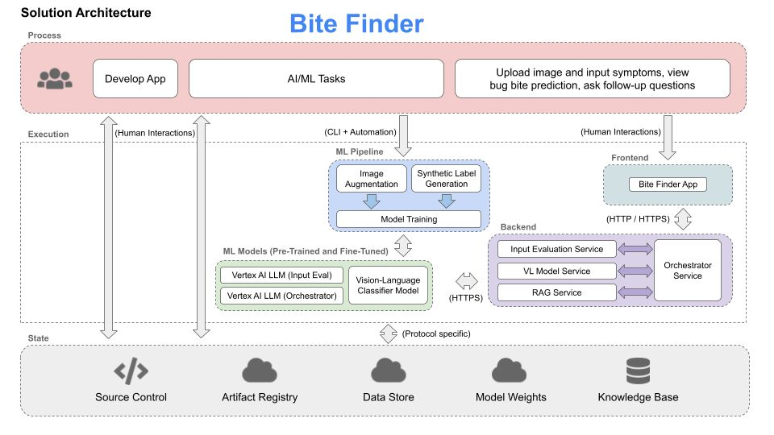
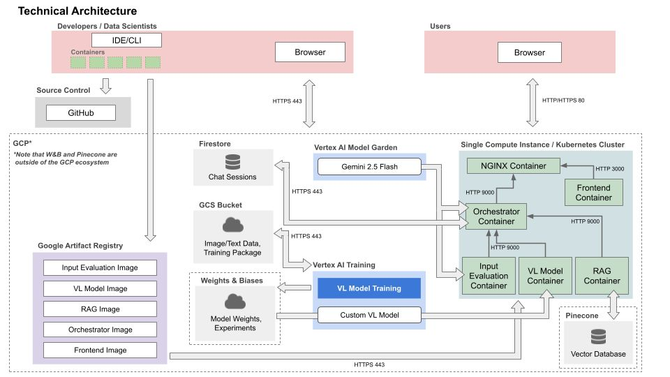

# BiteFinder: Using Multimodal AI to Identify Bug Bites and Deliver Personalized Treatment Advice

This article was produced as part of the final project for **Harvard’s AC215 Fall 2024** course.
Links: *[Project GitHub Repo](https://github.com/beni-1414/ac215_bitefinder)*, *[Demo Video — placeholder]*

Team: **BiteFinder — Jack Hwang, Zoe Zabetian, Irith Katiyar, Benet Fité Abril**

---

## Table of Contents

- [Introduction](#introduction-🐜)
- [Problem & Motivation](#problem--motivation-🕷️)
- [Our Solution](#our-solution-🔍)
- Technical Approach
  - [ML Pipeline](#ml-pipeline)
  - [Application Architecture](#solution-architecture-🏗️)
  - [Deployment & MLOps](#deployment--mlops)
- [Impact](#impact)
- [References](#references)

---

## Introduction 🐜

Imagine waking up with an itchy red bump on your arm, after hiking or spending time outdoors in a nice hot summer day. Was it a mosquito? A spider? Something more concerning? Most people don’t know, and searching online often leads to vague advice, panic-inducing speculation, or worse, misinformation. In the era of AI, where image recognition and large language models have made leaps in understanding visual and textual data, this uncertainty feels unnecessary.

**BiteFinder** aims to change that. It is an AI-powered web application that helps users **identify bug bites** from an image and receive **trusted, medically grounded treatment recommendations**. By combining image classification, text understanding, and retrieval-augmented generation (RAG), BiteFinder transforms a user’s photo and symptom description into actionable guidance in seconds.

Whether you're a curious camper, a concerned parent, or bug enthusiast, BiteFinder provides accessible, personalized insights right when you need them.

---

## Problem & Motivation 🕷️

Insects and arthropods are responsible for millions of bites each year, many of which result in:

- misidentification of the biting species
- delayed or incorrect treatment
- unnecessary anxiety
- avoidable doctor visits

Online resources are fragmented and generic, and while medical professionals can diagnose bites, access to one is not always immediate or affordable. Furthermore, ChatGPT-like models can generate convincing but unvalidated advice, and often reject to answer due to safety concerns.

**Our goal**: build a system that can classify the *type of bug bite* from user inputs and offer accurate, contextual advice on treatment, prevention and prognosis instantly and reliably.

---

## Our Solution 🔍

BiteFinder combines **multimodal AI**—vision-language models, large language models, and vector knowledge retrieval—to create a guided, conversational experience. Users:

1. Upload an image of a bite and describe symptoms and bite location
2. Receive a prediction such as *“mosquito”*, *“tick”*, *“spider”*, etc.
3. Ask follow-up questions like:
   - *“Should I apply hydrocortisone?”*
   - *“How long will swelling last?”*
4. Get medically grounded responses tailored to your specific case

The key innovation is the custom trained **vision-language model** and **Ranger Rick**, a *LangChain* agent that drinks from a *Pinecone* RAG pipeline, ensuring every response is rellevant and grounded.

---

## Technical Approach ⚙️

### ML Pipeline

The data for training the model comes from [Kaggle's Bug Bite Images dataset](#references). Our multimodal system integrates three core components:

| Component | Purpose |
|----------|---------|
| **Synthetic label generator** | Creates diverse symptom/location labels using LLM-based synthesis |
| **Image augmentation** | Expands dataset via rotation, jitter, and perturbations |
| **Vision-Language classifier** | Uses paired image–text embeddings to identify bug bite type |

We experimented with **CLIP** and **ViLT** architectures and performed systematic hyperparameter sweeps. The best model—**CLIP with 1 unfrozen layer and a 3-layer classification head**—achieved: TODO review this

- **94.0% validation accuracy**
- **94.8% confidence on correct predictions**

Model weights, metadata, and experiment logs are tracked via *Weights & Biases* for reproducibility. TODO add a note on the continuous deployment.

---

### Solution Architecture 🏗️

Our system follows a microservices design:

- **Input Evaluation Service** — checks text and image quality
- **Vision-Language Model Service** — performs bug bite prediction
- **RAG Service** — retrieves medical context and generates treatment guidance
- **Orchestrator Service** — controls the conversation, hosts the LangChain agent, and coordinates all upstream services
- **Frontend** — a React-based chat interface that enables seamless interaction, that also hosts many informative resources about bug bites, including prevention tips and when to seek medical attention.

---

### Technical Architecture ☁️

BiteFinder is deployed using a modern MLOps stack centered on Google Cloud Platform:

- **GitHub Actions** for CI/CD, ensuring automated testing and deployment.
- **Dockerized microservices** running on a Kubernetes cluster, capable of autoscaling to meet demand.
- **Vertex AI** for automated training jobs.
- **GCS bucket** for image/text data storage and versioning.
- **Pinecone** for vector-based medical knowledge retrieval.
- **Firestore** for user session management and conversation history.
- **Weights & Biases** for experiment tracking and for model versioning.

Each backend service container is fully tested, exceeding the **70% code coverage requirement**, and the entire application can be rebuilt via a single `/deploy-app` commit trigger.

TODO: update the technical architecture to include Firestore.
---

## Impact 🌎

BiteFinder democratizes access to bite-related medical knowledge by providing:

- **Explainable predictions** backed by a custom trained vision-language model, not general LLM guesswork.
- **Fast, personalized insights** at the moment of concern, backed by trusted medical sources.
- **Reduced medical uncertainty** for users without clinical expertise or immediate access to care.
- A foundation that could expand to include:
  - other venomous animal encounters
  - distinction between allergic reactions and bites
  - travel-specific bite alerts
  - telemedicine integrations
  - public health monitoring
  - Offline distilled mobile app for field use.

By blending cutting-edge multimodal AI with practical user needs, BiteFinder empowers people to better understand their health without unnecessary anxiety or delay.

---

## References

- [Kaggle Dataset: Bug Bite Images](https://www.kaggle.com/datasets/moonfallidk/bug-bite-images)
- [Pinecone](https://www.pinecone.io/)
- [CLIP](https://openai.com/index/clip/)
- [ViLT](https://arxiv.org/abs/2102.03334)
- [LangChain](https://langchain.com/)
- [Weights & Biases](https://wandb.ai/site)
- *Additional references available in project repo*

---

*Curious how BiteFinder works? Explore our repo and try the app, just don’t blame us if you start inspecting every little bite you get next summer.*
