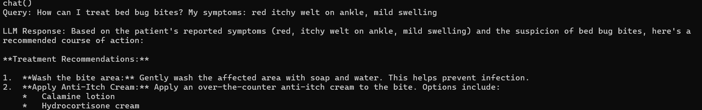

# RAG model


## Versions
### v1.0
   - Uses `ChromaDB` to store and retrieve text embeddings related to insect bites and treatment.
   - Uses an Gemini to generate natural-language advice.


### Input DataBase Overview
Stores the bug bite information from cleveland clinic
- Overview
- Symptoms and Causes
- Management and Treatment
- Prevention
- Living With

### Usage

**Manual Docker Commands:**
```bash
# Build and run
docker network create llm-rag-network
docker build -t llm-rag-cli -f Dockerfile .
docker-compose run --rm --service-ports llm-rag-cli
```

## command to chat
Requires symptoms text from the user, and class output from the vision model.
```bash
python cli.py --chat --chunk_type char-split \
  --symptoms "red itchy welt on ankle, mild swelling" \
  --class "bed bug"
```


## Example

